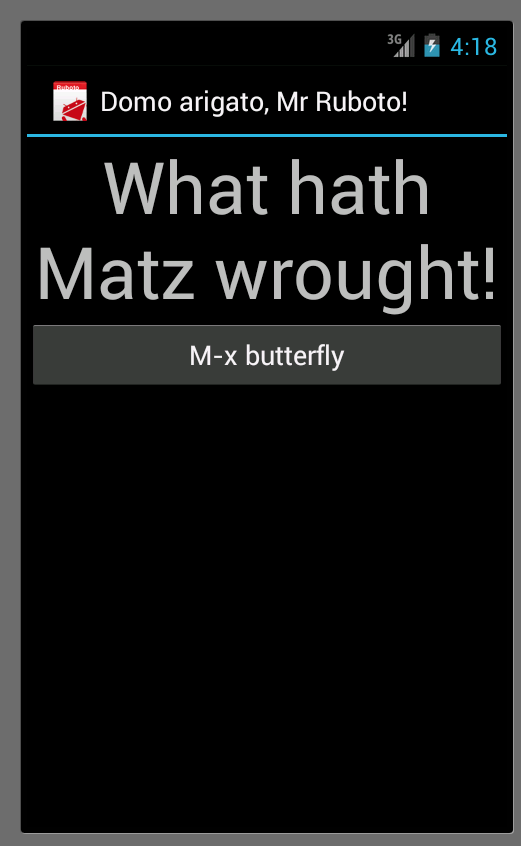

!SLIDE bullets incremental
# JRuby + Android => Ruboto
* Opens up full Android SDK in Ruby
* Ruby components whenever possible
* Build and deployment framework

!SLIDE bullets incremental
# On Ruboto
 * Requires Java, JRuby, and Android SDK
 * Packaged as a gem
 * Code & Development Framework

!SLIDE commandline
# Getting Started

### Reference: [Getting Started Tutorial](https://github.com/ruboto/ruboto/wiki/Setting-Up-a-Ruboto-Development-Environment)

    $ ruboto gen app \
      --package org.ruboto.example.quick_start \
      --target=android-17

!SLIDE bullets incremental
# What We Wrought
 * Project Configuration
 * Android Manifest
 * Java Integration Classes
 * Ruby Entry Activity

!SLIDE smaller
# Manifest

    @@@xml
    <manifest package='org.ruboto.example.quick_start'>
      <application android:hardwareAccelerated='true' 
        android:icon='@drawable/ic_launcher' 
        android:label='@string/app_name'>
        <activity android:label='@string/app_name'
          android:name='QuickStartActivity'>
          <intent-filter>
            <action android:name='android.intent.action.MAIN'/>
            <category android:name='android.intent.category.LAUNCHER'/>
          </intent-filter>
        </activity>
        <activity android:name='org.ruboto.RubotoActivity'/>
        <activity android:name='org.ruboto.RubotoDialog'/>
        <service android:name='org.ruboto.RubotoService'/>
     </application>
     <uses-sdk android:targetSdkVersion='17'/>
    </manifest>

!SLIDE smaller
# Java Activity Wrapper

    @@@java
    package org.ruboto.example.quick_start;

    import android.os.Bundle;

    public class QuickStartActivity 
       extends org.ruboto.EntryPointActivity {
      public void onCreate(Bundle bundle) {
        getScriptInfo().setRubyClassName(
         getClass().getSimpleName());
          super.onCreate(bundle);
      }
    }

!SLIDE smaller
# Simplified Activity

    @@@ruby
    require 'ruboto/widget'
    require 'ruboto/util/toast'

    ruboto_import_widgets :Button, :LinearLayout, :TextView

    class QuickStartActivity
      def on_create(bundle)
        super
        set_title 'Domo arigato, Mr Ruboto!'

        self.content_view =
            linear_layout(:orientation => :vertical) {
              @text_view = text_view 
               :text => 'What hath Matz wrought?'
    
              button :text => 'M-x butterfly', 
               :on_click_listener => proc { butterfly }
            }
      end

      def butterfly
        @text_view.text = 'What hath Matz wrought!'
        toast 'Flipped a bit via butterfly'
      end

    end

!SLIDE center

!SLIDE smaller
# Unit Testing

    @@@ruby
    activity Java::org.ruboto.example.quick_start.QuickStartActivity

    setup do |activity|
      start = Time.now
      loop do
        @text_view = activity.findViewById(42)
        break if @text_view || (Time.now - start > 60)
        sleep 1
      end
      assert @text_view
    end

    test('initial setup') do |activity|
      assert_equal "What hath Matz wrought?", @text_view.text
    end

    test('button changes text') do |activity|
      button = activity.findViewById(43)
      button.performClick
      assert_equal "What hath Matz wrought!", @text_view.text
    end
